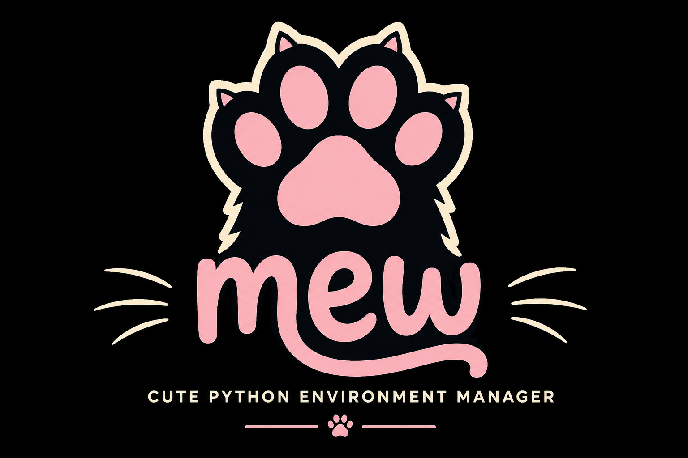
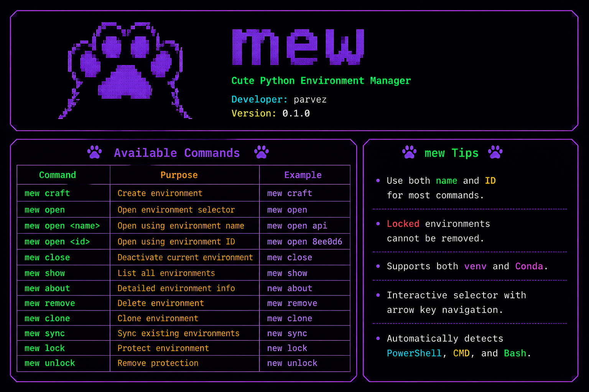

<p align="center">
	
	<br/>
	
</p>

[](LICENSE)
[](https://www.python.org/)
[](#)
[](#)

# mew — Lightweight Python environment manager

mew is a terminal-first environment manager for Python and Conda that makes creating, switching, and managing environments simple, fast, and predictable.

Table of Contents
-----------------

- [About](#about)
- [Quick Start](#quick-start)
- [Features](#features)
- [Commands](#commands)
- [Contributing](#contributing)
- [License](#license)

## About

mew provides a small, focused CLI for environment workflows. It tracks environments in a registry, provides human-friendly names plus unique IDs, and supports both `venv` and `conda` backends.

## Quick Start

Clone and install locally:

```bash
git clone https://github.com/your-username/mew.git
cd mew
pip install -e .
```

Run the interactive helper:

```bash
mew craft
```

## Features

- Support for Python `venv` and Conda
- Registry-backed environment tracking
- Interactive selectors and modern terminal UI
- Lock/unlock protection for important environments
- Clone, sync, and export workflows
- Portable, minimal, and scriptable CLI

## Commands

| Command | Description |
|---|---|
| `mew craft` | Create a new environment (interactive) |
| `mew open [NAME|ID]` | Activate or open an environment by name or ID |
| `mew close` | Deactivate current environment |
| `mew show` | List tracked environments |
| `mew about` | Show environment details |
| `mew remove` | Remove an environment (requires unlock) |
| `mew clone` | Clone an existing environment |
| `mew sync` | Import existing system environments into the registry |
| `mew lock` / `mew unlock` | Protect or unprotect an environment |

## Usage examples

Create an environment with the interactive flow:

```bash
mew craft
```

Open an environment by name or ID:

```bash
mew open myenv
mew open 59a9c3
```

List environments:

```bash
mew show
```

## Contributing

Contributions are welcome. Please follow these steps:

1. Fork the repository.
2. Create a feature branch: `git checkout -b feat/your-feature`.
3. Make changes and add tests where appropriate.
4. Open a pull request describing your changes.

Please keep changes focused and document new behaviors in the README or inline help.

## License

This project is licensed under the MIT License — see the included `LICENSE` file for details.

---

Maintainers: the project maintainers and community contributors.


